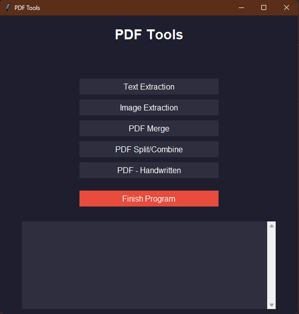

# 👩🏻‍💻 INTRODUÇÃO

**`Programador`**

Meu nome é **Paulo Henrique**, interessado em tecnologia e no estudo aprofundado de como os códigos funcionam e podem ser implementados. Tenho grande apreço pelo ecossistema Linux, pela eficiência e liberdade que oferece no desenvolvimento, especialmente em projetos relacionados a tecnologias como o Tor. Busco constantemente aprimorar meus conhecimentos e aplicá-los em soluções práticas e seguras.

    
     
    
    

## 🤖 Linguagens e Tecnologias

 
 

## Projetos
<!-- Abas simuladas com details/summary -->

  
🧭 <strong>PDF-Tools</strong>

   
  

  ### 📂 Repositório  
  🔗 [Abrir prévia do projeto](https://phsds.github.io/PDF-Tools "Abrir prévia do projeto")

  ### 📝 Descrição rápida  
  Ferramenta para automatização de OCR em documentos PDF.

  
  

