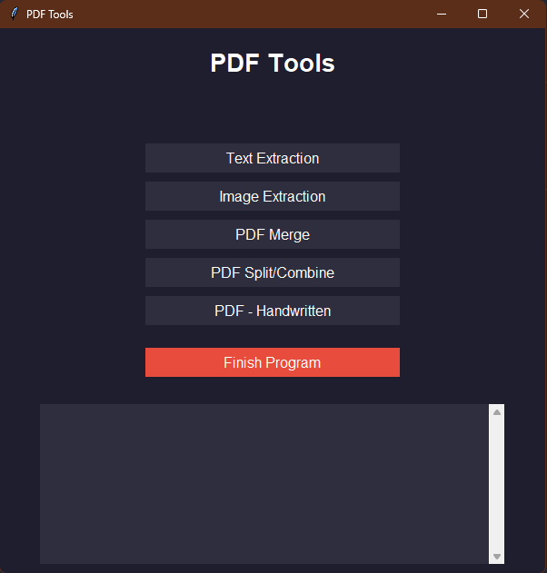
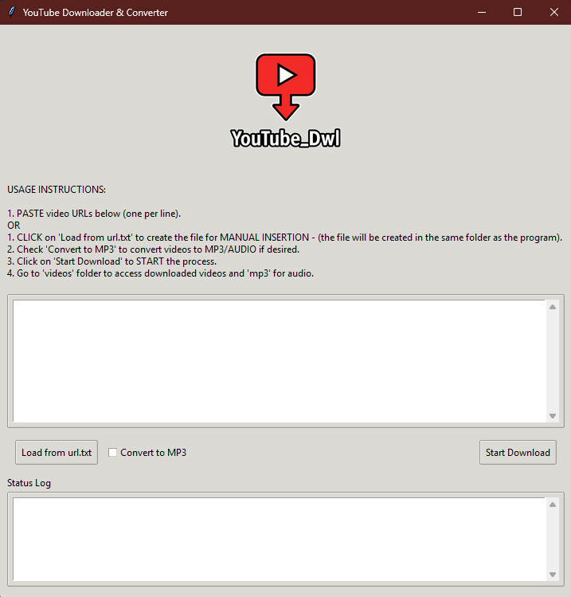

# ⚡ Paulo Henrique

    
    

---

### 👨‍💻 `cat /home/phsds/about.txt`

> **`sys.info()`**: Interessado em tecnologia e no estudo aprofundado de como os códigos funcionam e podem ser implementados. Tenho grande apreço pelo ecossistema Linux, pela eficiência e liberdade que oferece no desenvolvimento, especialmente em projetos relacionados a tecnologias como o Tor. Busco constantemente aprimorar meus conhecimentos e aplicá-los em soluções práticas e seguras.

---

### 🛠️ `./stack_info.sh`

   
  
    

---

### 🚀 `ls -la /var/www/projects`

<table align="center" width="100%" style="border-collapse: collapse; border: none;">
  <tr>
    <td align="center" width="50%" style="border: none; padding: 20px;">
      <h4>📄 PDF-Tools</h4>
      
        
      
<i>Ferramenta para automatização de OCR em documentos PDF.</i>

      
    </td>
    <td align="center" width="50%" style="border: none; padding: 20px;">
      <h4>🎵 YouTube_Dwl</h4>
      
        
      
<i>Download de vídeos do YouTube e conversão para formato MP3.</i>

      
    </td>
  </tr>
</table>

---

### 📊 `htop`

  
  

